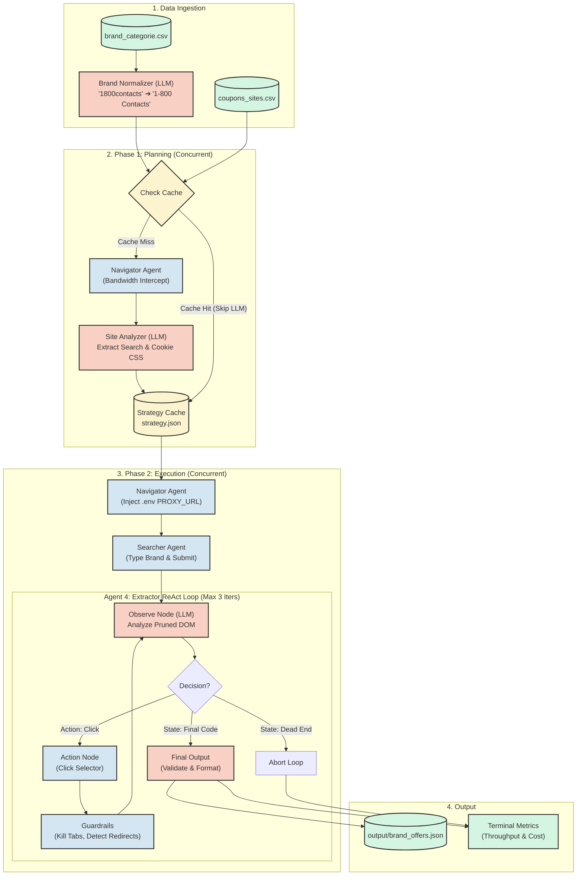

# Agentic Commerce Scraper - Architecture

Complete architectural flow of the system. 

```mermaid
flowchart TD
    %% Styling
    classDef llm fill:#f9d0c4,stroke:#333,stroke-width:2px;
    classDef playwright fill:#d4e6f1,stroke:#333,stroke-width:2px;
    classDef data fill:#d5f5e3,stroke:#333,stroke-width:2px;
    classDef cache fill:#fcf3cf,stroke:#333,stroke-width:2px;

    %% Inputs
    subgraph Inputs ["1. Data Ingestion"]
        A[(coupons_sites.csv)]:::data
        B[(brand_categorie.csv)]:::data
        C["Brand Normalizer (LLM)<br/>'1800contacts' ➔ '1-800 Contacts'"]:::llm
        B --> C
    end

    %% Phase 1
    subgraph Phase1 ["2. Phase 1: Planning (Concurrent)"]
        D{"Check Cache"}:::cache
        E["Navigator Agent<br/>(Bandwidth Intercept)"]:::playwright
        F["Site Analyzer (LLM)<br/>Extract Search & Cookie CSS"]:::llm
        G[("Strategy Cache<br/>strategy.json")]:::cache

        D -- "Cache Miss" --> E
        E --> F
        F --> G
        D -- "Cache Hit (Skip LLM)" --> G
    end
    
    C --> D
    A --> D

    %% Phase 2
    subgraph Phase2 ["3. Phase 2: Execution (Concurrent)"]
        H["Navigator Agent<br/>(Inject .env PROXY_URL)"]:::playwright
        I["Searcher Agent<br/>(Type Brand & Submit)"]:::playwright
        
        subgraph ReAct ["Agent 4: Extractor ReAct Loop (Max 3 Iters)"]
            J["Observe Node (LLM)<br/>Analyze Pruned DOM"]:::llm
            K{"Decision?"}
            L["Action Node<br/>(Click Selector)"]:::playwright
            M["Guardrails<br/>(Kill Tabs, Detect Redirects)"]:::playwright
            N["Final Output<br/>(Validate & Format)"]:::llm
            
            J --> K
            K -- "Action: Click" --> L
            L --> M
            M --> J
            K -- "State: Final Code" --> N
            K -- "State: Dead End" --> O["Abort Loop"]
        end
    end

    G --> H
    H --> I
    I --> J

    %% Outputs
    subgraph Outputs ["4. Output"]
        P[("output/brand_offers.json")]:::data
        Q["Terminal Metrics<br/>(Throughput & Cost)"]:::data
    end

    N --> P
    N --> Q
    O --> Q
```
